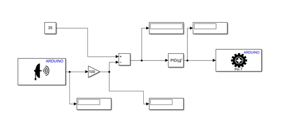

# Ball-Balancing-using-PID-controler

The goal of this project is to build a model-based PID ball balancing system using Arduino UNO and MATLAB Simulink. The system is fairly straightforward. The way this system functions is that it should sense the position of the ball on a track by using the ultrasonic sensor. A subtraction operation between the set point, center of the track used, and the value read by the ultrasonic sensor produces the error distance. The error distance of the ball is then fed into the Proportional-Integral-Derivative (PID) Controller which then signals the servo motor that is placed under the track to move either up or down in order to balance the ball and bring it back to the center of the track.

### Design

### PID Controller

A PID controller is a device that regulates temperature, flow, pressure, speed, and other process
variables in industrial control applications. PID (proportional integral derivative) controllers are the
most precise and stable controllers because they use a control loop feedback mechanism to control
process variables. PID control is a well-known method for guiding a system to a desired location or
level. PID control employs closed-loop control feedback to maintain a process's real output as close
as feasible to the target or setpoint output. the figure below shows the PID ball balance system design.

### Simulink

For the software part, we used an ultrasonic block, Discrete PID controller block, servo motor block,
and other blocks as shown in Fig.4. The ultrasonic sensor will continually read the distance and feed
it to the PID controller which will try to minimize the error by turning the servo motor.

